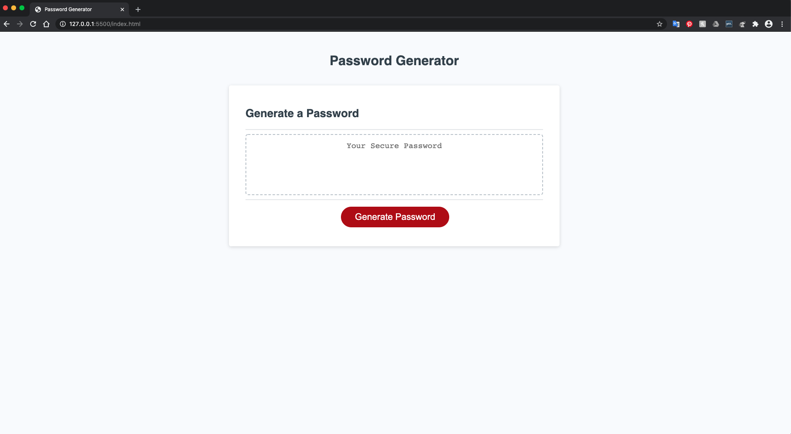

# Password Generator 
> A password generator designed to pick at random a secure password for the user utilizing Javascript.

## Table of contents
* [General info](#general-info)
* [Screenshots](#screenshots)
* [Setup](#setup)
* [Features](#features)
* [Status](#status)
* [Inspiration](#inspiration)
* [Contact](#contact)

## General info
A password generator designed to pick at random a secure password for the user utilizing Javascript. HTML and CSS provided by the Northwestern Coding bootcamp. 

## Screenshots

## Setup

To get this project up and running follow the steps bellow.

1. Navigate to the main page of the repository
2. Under the repository name, click Clone or download
3. In the Clone with HTTPSs section, click the copy
4. Open Terminal
5. Change the current working directory to the location where you want the cloned directory to be made.
6. Type ‘git clone’ and then paste the URL you copied
	- $ git clone https://github.com/aidabyte/Password-Generator-HW.git
7. Press Enter. Your local clone will be created.

## Code Examples
See Code in action: https://aidabyte.github.io/Password-Generator-HW/

## Features
1. A generate button
2. Prompts and Confirms
3. After all the user data is collected a random password is generated
4. Variable declaration area
5. Event listener on click

## Status
Project is: _in progress_ because I am still learning.

## Inspiration
Project inspired by homework given by Northwestern Coding bootcamp 2020

## Contact
Created by [@aida](https://https://github.com/aidabyte) - feel free to contact me!
